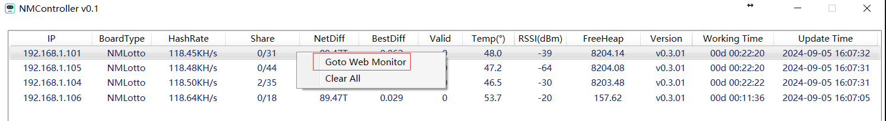
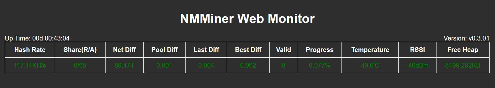

# NMMiner - Group Controller in your LAN

## Description
NMController is designed for the devices:

- [NMMiner](https://github.com/NMminer1024/NMMiner.git) version v0.3.01 or higher
- [NMAxe](https://github.com/NMminer1024/ESP-Miner-NMAxe.git) , which will coming soon.

The NMController will listen the UDP Broadcast in Port: 12345, any devices can be recognized on this channel according to the specified JSON format.

```json
{
    "IP": "192.168.1.101",
    "BoardType": "NMLotto",
    "HashRate": "113.13K",
    "Share": "1/138",
    "NetDiff": "89.47T",
    "PoolDiff": "0.001",
    "LastDiff": "0.001",
    "BestDiff": "4.021M",
    "Valid": 0,
    "Progress": 0.167,
    "Temp": 48.5,
    "RSSI": -62,
    "FreeHeap": 8203.9,
    "Uptime": "00d 01:23:46",
    "Version": "v0.3.01"
}
```

## Features

The NMController is developed based on C#/WPF.

### Install
Just install the NMControllerSetup_x64.msi or NMControllerSetup_x86, which can download from the Release. 

### Running
It runs like this:


Currently, support the device type, HashRate, Share info, net difficulty, best difficulty, valid block num, device temp(℃), RSSI(dBm), device free heap (KB), and the working time.

For future applicaion, we can browse the web monitor runs on the specified device with the **Right Click Menu**.



The Web Monitor like this:




## Contact
- Anything do not work as your expectation, just let us know.

| Email                   |  Telegram                       |
| :-----------------:     |  :-----------------:            |
|nmminer1024@gmail.com    |  https://t.me/+IYFC1D0al1E5Yjdl |