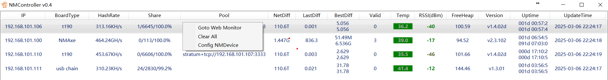
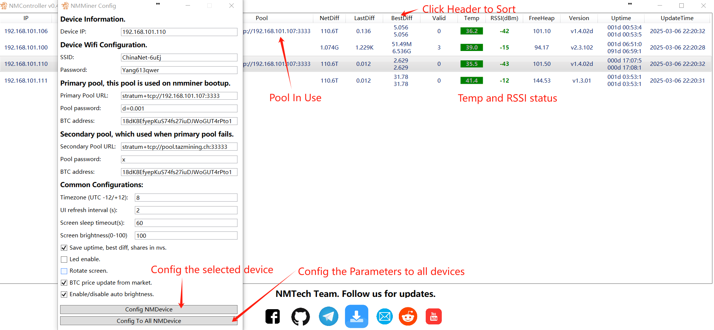

# NMMiner - Group Controller in your LAN

## 1. Description
NMController is designed for the devices:

- [NMMiner](https://github.com/NMminer1024/NMMiner.git) version v0.3.01 or higher
- [NMAxe](https://github.com/NMminer1024/ESP-Miner-NMAxe.git) , 2.5.x or higher.

The NMController will listen the UDP Broadcast in Port: 12345, any devices can be recognized on this channel according to the specified JSON format.

```json
{
    "IP": "192.168.1.101",
    "BoardType": "NMLotto",
    "HashRate": "113.13K",
    "Share": "1/138",
    "NetDiff": "89.47T",
    "PoolDiff": "0.001",
    "LastDiff": "0.001",
    "BestDiff": "4.021M",
    "Valid": 0,
    "Progress": 0.167,
    "Temp": 48.5,
    "RSSI": -62,
    "FreeHeap": 8203.9,
    "Uptime": "00d 01:23:46",
    "Version": "v0.3.01",
    "PoolInUse": "public-pool.io:21496"
}
```

## 2. Features

The NMController is developed based on C#/WPF.

### 2.1 Install
Just install the NMControllerSetup_x64.msi or NMControllerSetup_x86.msi, which can download from the Release. 

### 2.3 Running
It runs like this:



Currently, support the IP, device type, HashRate, Share info, net difficulty, best difficulty, valid block num, device temp(℃), RSSI(dBm), device free heap (KB), and the working time.

- [0.0.4] Add the pool in Use; Support the Header Sort.

For future applicaion, we can browse the web monitor runs on the specified device with the **Right Click Menu**.


The Web Monitor like this:


### 2.4 Configuration

In order to better management of multiple devices, like nm-bot-chain tower, CYD, nm-use-chain, NMAxe farm. NMController add the config function.


With the UDP broadcast data on port 12347.

```json
{
    "IP": "0.0.0.0",
    "WiFiSSID": "nmap-2.4g",
    "WiFiPWD": "12345678",
    "PrimaryPool": "stratum+tcp://pool.nmminer.com:3333",
    "PrimaryPassword": "d=0.001",
    "PrimaryAddress": "18dK8EfyepKuS74fs27iuDJWoGUT4rPto1.CYD",
    "SecondaryPool": "stratum+tcp://public-pool.io:21496",
    "SecondaryPassword": "x",
    "SecondaryAddress": "18dK8EfyepKuS74fs27iuDJWoGUT4rPto1.CYD",
    "Timezone": 8,
    "UIRefresh": 3,
    "ScreenTimeout": 30,
    "Brightness": 100,
    "SaveUptime": true,
    "LedEnable": true,
    "RotateScreen": false,
    "BTCPrice": false,
    "AutoBrightness": true
}
```
If the IP is "0.0.0.0", it means all the device should change to the parameters; if not the broadcast IP("0.0.0.0"), only the device corresponding to the IP address will update information.

#### 2.4.1 Backup Config
Save the configuration of the device to the "config.json" as default. You can rename the config.json to whatever you like, to save as for different Crypto, different Pool, etc.

*Notice: if your NMController installed at the "C:/", which maybe need administrator privileges to backup config file.*

#### 2.4.2 Load Config
The Load Config, you can choose the "config.json" you saved, if success, will loading to the ConfigWnd, you can config to a NM device, or Config to all NMDevices.

## Release log

### (2025.3.11-v0.4.1)
- **Features**:
  - Add Configuration backup and load function;
  - fix the issue: when low screen resolution, the config window cannot be fully displayed.

### (2025.3.5-v0.4.0)
- **Features**:
  - Add the config Function, can use the NMController to config a NMMiner or all the NM Series devices( NMMiner and NMAxe/NMAxe-Gamma );
  - Add the contact links: Telegram, youtube, facebook, reddit, github and email.

### (2025.3.3-v0.3.0)

- **Features**:
  - Update the UI, Temp and RSSI will prompts based on different stats;
  - The offline devices will be displayed in gra;
  - The Header support sort.

## Contact
- Anything do not work as your expectation, just let us know.

| Email                   |  Telegram                       |
| :-----------------:     |  :-----------------:            |
|nmminer1024@gmail.com    |  https://t.me/NMMiner |